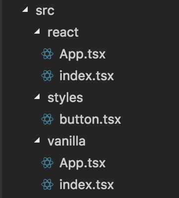
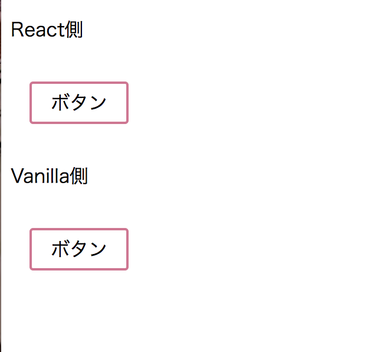

最近はWebサービスにおけるCSSの良い管理、運用方法について悶々と考えており、なんやかんやで `emotion` というのを見つけたので簡単に触ってみた。

## やりたかったこと

* 1つのCSSをReactと他のJSフレームワーク両方で利用
* CSSはグローバルスコープを気にせず利用できること

イメージとしてはメンテナンスすべきCSSは1つで、そのCSSを各画面、機能が各々のJSフレームワークを使って利用する。という感じ。
奇特な状況のように見えるが、比較的大きい昨今のWebサービスだとまぁまぁある状況かなと考えています。

今回はReactとVanilla JS の2つでまずは共通のCSSを利用してみました。

## emotion について

CSS-in-JSを実現するためのライブラリでReactに限らず、他のJSフレームワークでも利用できる。( [styled-components](https://www.styled-components.com/) をCSS-in-JSに特化させたようなイメージ)
詳細は [参考記事](/emotion-react-vanilla-sample/#参考記事) の方でとてもよくまとめていただいているので割愛。

## emotion の利用のステップ

以下の2つのnpmパッケージをインストール(2018年12月時点ではv10系がインストールされるはず)

```sh
npm install @emotion/core
npm install emotion
```

`@emotion/core` は React、 `emotion` はVanillaJSで それぞれemotionを使うために利用します。

## React, VanillaでのCSS利用サンプル

共通のCSS用ファイルを1つ用意し、React, Vanillaそれぞれで利用してみました。
結果としては意図通り、同じCSSを利用できることを確認。

#### フォルダ構成(craete-react-app で作成したプロジェクトを少し改良)



#### 共通CSS

```javascript
export const Button = `
  background-color: palevioletred;
  color: white;
  font-size: 1em;
  margin: 1em;
  padding: 0.25em 1em;
  border: 2px solid palevioletred;
  border-radius: 3px;
`;
```

#### React側のCSS利用コード

```javascript
/** @jsx jsx */
import { css, jsx } from '@emotion/core';
import * as React from 'react';
import { Button } from '../styles/button';

const button = css`
  ${Button}
`;

class App extends React.Component {
  public render() {
    return (
      <div >
        <p>React側</p>
        <button css={button} >ボタン</button>
      </div>
    );
  }
}

export default App;
```

#### VanillaJS側のCSS利用コード

```javascript
import { css } from 'emotion';
import { Button } from '../styles/button';

const button = css`
  ${Button}
`;

const App = document.createElement('div');
App.innerHTML = `
<p>Vanilla側</p>
<button class="${button}">ボタン</button>
`;

export default App;
```

#### 結果画面



作成したサンプルは [こちら](https://github.com/nishimura-yuki/emotion-test) にもアップしています。

## 所感

CSS Modulesのようなグローバルスコープを気にしないCSSをVanilla & CSS-in-JSで実装できたので、軽量なUIライブラリ的なものを作るのにはかなりよい選択肢になると感じました。
しかし当初考えていた「共通CSSライブラリ的なものを複数のJSフレームワークで利用」といった用途で活用するには、共通化できるものがCSSしかないので、 `emotion` 単体でCSSフレームワークを作るくらいの勢いがないとちょっと難しいかなというイメージです。。
(とはいえ、実現できた場合にはJavaScriptベースでカラーコードやサイズなどの情報がやりとりできるようになるので、夢は広がりそう)
当初の目的についてはもっと検討が必要だな。

あらためて [公式ドキュメント](https://emotion.sh/docs/introduction) を見てみると、「Vanillaでも使えるけどReactで使ったほうがいい機能いっぱいあるよ」的なこと書かれてるな。確かに、なんやかんやで `styled-components` は便利。

## 参考記事

- [emotion - フレームワークに依存しない洗練された CSS-in-JS](https://tech.recruit-mp.co.jp/front-end/post-17543/)