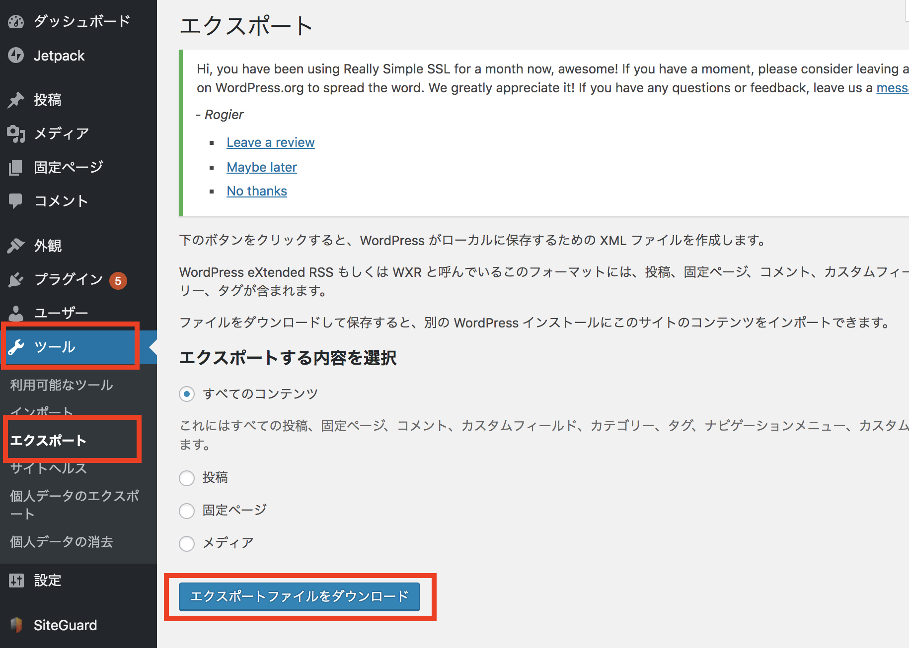

すでに流行に乗り遅れてる感がありましたが、 `Gatsby` という静的サイトジェネレータを使ってReactベースにブログが作成できると聞き、試してみつつ既存のWordpressをGatsbyに完全移行しました。  
移行までの道のりを紹介したいと思います。  
 

## 移行にあたっての目標

- 既存のWordpressブログをGatsbyで再構築する
- 記事内容はマークダウンで管理できるようにする
- ブログテーマは自前で用意ではなくテンプレートを使い、あまり時間をかけないようにする
- ブログ全体のコードはGitで管理し、masterへのプッシュ時にブログが自動更新されるようにする(運用負荷軽減)

上記目標達成に向けて以下のステップで進めました。

1. Wordpressの記事データをエクスポートしマークダウン形式に変換
2. Gatsbyをインストールし、テンプレートを使ってブログプロジェクトを作成
3. テンプレートをベースにブログの機能を拡張(細かい動きやスタイルなど)
4. Github & Netlifyを使ってブログを公開し、ネームサーバを移管

 
各ステップごとの作業と参考にした情報を交えながら紹介していきます。
 
 

## ステップ1. Wordpressの記事データをエクスポートしマークダウン形式に変換

このステップではGatsbyのインストールすら出てきませんが、マークダウンへの変換が実施するため移行という点では重要なステップになります。
 
 

### Wordpressの記事データをエクスポート

移行にあたりまずはWordpressに記録されている記事データをエクスポートする必要があります。  
一瞬「MySQLたたく必要あるのかな？？」と思いましたが、さすがにその機能(エクスポート)はWordpressに標準でついてました。  
手順は以下の通りです。

1. Wordpressの管理画面にログイン
2. メニューから `ツール` > `エクスポート` を選択し、エクスポートファイルのダウンロードを実施

これでWordpressの情報が `xmlファイル` として取得できます。
 
 

### XMLファイルをマークダウンに変換

xmlファイルの中身を解析してマークダウンファイルに変換する必要があります。  
これについてはすでに先駆者が変換スクリプトを公開してくれていたので、活用させていただきました。

- 活用させていただいた記事(アカベコさん、ありがとうございました)  
[WordPress の Markdown 移行補助ツールを開発してみた](https://akabeko.me/blog/2016/03/npm-wpxml2md-v1-0-0-release/)
 
 

## 次のステップ 

ステップ1はここまでです。
途中完全に乗っかっただけなので特筆すべきことはありませんが、[次のステップ](/gatsby-blog-getting-started-2/)でいよいよ `Gatsby` が登場します。

