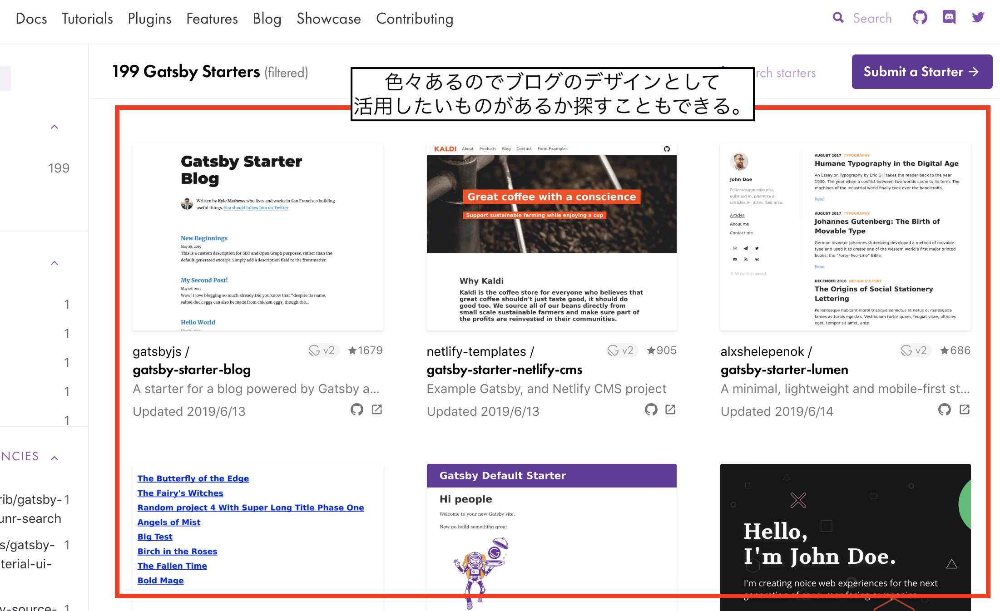
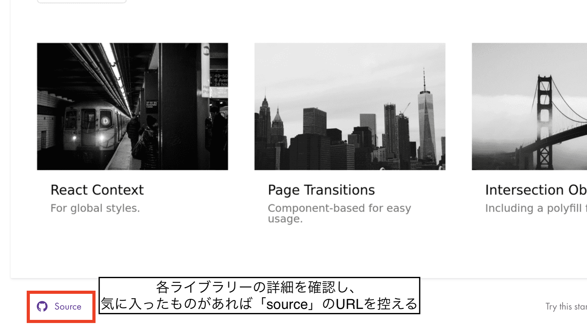

[前回(ステップ1)](/gatsby-blog-getting-started-1/)の続きになります。
<br/>
<br/>

## ステップ2. Gatsbyをインストールし、テンプレートを使ってブログプロジェクトを作成

### Gatsbyのセットアップ

[公式サイト](https://www.gatsbyjs.org/tutorial/part-zero/)もあるのであらためてインストールコマンドを書くではなく要点をまとめます。

1. Gatsbyを動かすにはNodeJS(バージョンは8以上)が必要  
→ 公式では `brew` を使ったインストール手順が紹介されていますが、[nvm](https://github.com/nvm-sh/nvm) とかでも大丈夫そうです。
2. Gitも必要  
→ 後述するStarter Library(テンプレートのようなもの)でプロジェクトを作成する際に必要なためGitもインストールしておく
3. 上記2つが用意できている状態で `gatsby-cli` をインストール
```sh
npm install -g gatsby-cli
```
<br/>

### Gatsby Starter Libraryからテンプレートを選択してプロジェクトを作成

Gatsbyではサイト構築のノウハウやテンプレートとなるデザインを [Starter Library](https://www.gatsbyjs.org/starters/?v=2) として提供してくれています。
フルスクラッチでGatsbyを学習しながらサイトやブログを構築するのであれば利用しなくてもよいですが、私のような「既存のブログをいい感じのデザインでさっさと移行したい」という人にはこちらを活用するのがおすすめです。
<br/>
<br/>

1. Starter Libraryから利用したいテンプレートを選択  
→ 気に入ったものであればなんでもよいですが、今回の流れであればマークダウンでのサイト作成に対応しているものにする必要があります。



2. テンプレートが決まったらGithubのURLを控える


3. `gatsby new` コマンドでプロジェクト作成  
2で控えたURLを使って以下のコマンドを実行します
```sh
gatsby new `フォルダ名` `2で控えたURL`
```
```sh
例: 私の場合
gatsby new my-blog https://github.com/BoyWithSilverWings/gatsby-blog-starter
```

4. Libraryの準備完了後ローカルで確認してみる
```sh
cd `フォルダ名`
gatsby develop
# ローカルのサーバ起動後、 http://localhost:8080 にアクセスする
```
<br/>
<br/>

### ステップ1で変換したマークダウンファイルをプロジェクトフォルダ内に設置する

Libraryによって記事のマークダウンファイルの設置場所はまちまちですが、まずは設置場所を見つけてWordpressから変換したマークダウンファイルを設置します。  
私が選択した `BoyWithSilverWings/gatsby-blog-starter` では `src/content` がマークダウンファイルの設置場所となっていました。

また、Gatsbyではマークダウンファイルの上段箇所に記事のメタ情報を記述することもできます。  
メタ情報には `記事作成日` `タイトル` `タグ` `カテゴリ` などの情報を自由に含むことが可能です。  
メタ情報は以下のように記述することで定義できます。

```md
---
path: "/blog/my-first-post" # 記事のパス
date: "2019-05-04" # 記事の作成日
title: "title" # 記事のタイトル
---

※ ここから記事の本文情報
```
<br/>
<br/>

## 次のステップ 

ステップ2はここまでです。
次のステップではGatsbyの設定や機能で抑えておくとよいポイントについて紹介します。


