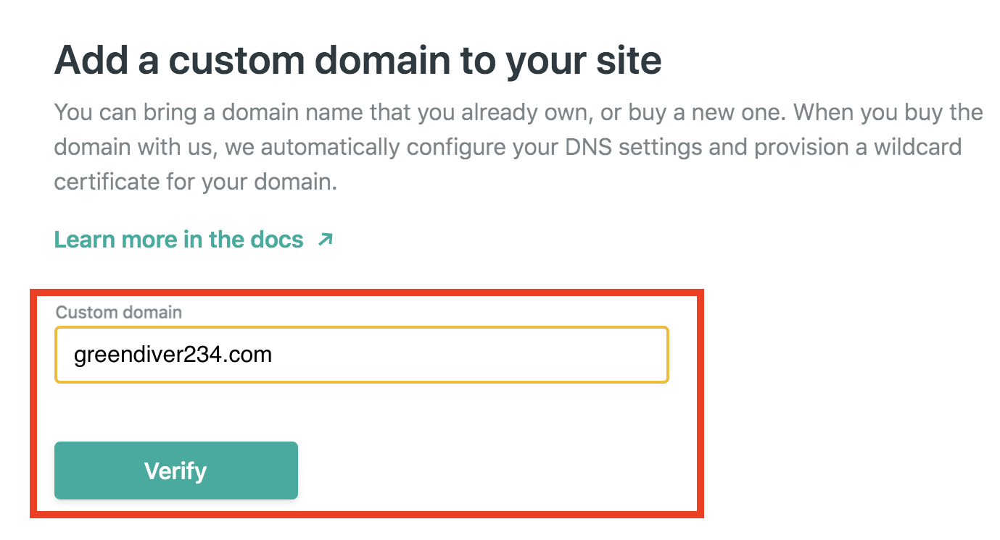

[前回(ステップ3)](/gatsby-blog-getting-started-3/)の続きになります。
 
 

## ステップ4. Github & Netlifyを使ってブログを公開し、ネームサーバを移管

ここまででローカル環境に公開したいブログの情報があらかた揃っているはずなので、今回はGithub & Netlifyを使ったブログ公開&最終移行の流れを紹介します。
 
 

### Githubにリポジトリを作成しコードをプッシュする

Githubのアカウント作成やリポジトリの作成方法については省略します。
コミットしてGithubリポジトリにプッシュをしてください。
 
 

### Netlifyのアカウントを作成する

[Netlifyのページ](https://www.netlify.com/)にアクセス

特に問題なければGithubアカウントでサインアップするのが速い

 
 

### 新規サイトを作成する
サインアップ後そのままサイト作成の流れになります。

Githubリポジトリからサイトを作成する

 
 

### Githubリポジトリを選択してサイトを作成する

ブログ用に作成したリポジトリを選択

ビルドの設定  
特になにもしなくてもよしなにしてくれるけど、もし設定欄が空だった場合はキャプチャを参考にビルド設定をする

 
 

### 独自ドメインを登録する
サイト作成後、サイト情報画面が表示されるので引き続きドメインの設定を行う。

独自ドメインを追加する

独自ドメインを入力して追加

 
 

### 移管先ネームサーバの情報を確認して移管する
追加した独自ドメインのDNS情報を表示

ネームサーバ情報を控える

ドメインを取得したサービスに応じて、↑で確認したネームサーバ情報を設定します。  
代表的なサービスについて以下にリンクをはっておきます。

- [お名前ドットコムの場合](https://www.onamae.com/guide/p/67)
- [ムームードメインの場合](https://muumuu-domain.com/?mode=guide&state=ns_other)
- [VALUE-DOMAINの場合](https://www.value-domain.com/userguide/manual/transferother/)
- [さくらのドメインの場合](https://help.sakura.ad.jp/hc/ja/articles/206205831-%E3%83%8D%E3%83%BC%E3%83%A0%E3%82%B5%E3%83%BC%E3%83%90%E6%83%85%E5%A0%B1%E3%81%AE%E5%A4%89%E6%9B%B4)
 
 

### ネームサーバの移管完了後、SSL設定を有効にする
おそらくネームサーバの移管が完了したら自動的にSSLも有効化してくれるみたいですが、以下の画面からも設定できるみたいです。

 
 

## 最後に 

Gatsbyを使ったブログ公開までの流れを4つのステップで紹介してきました。  
最終的なソースコードはGithubにて公開しているので参考にしていただければと思います。  
https://github.com/nishimura-yuki/greendiver-log

