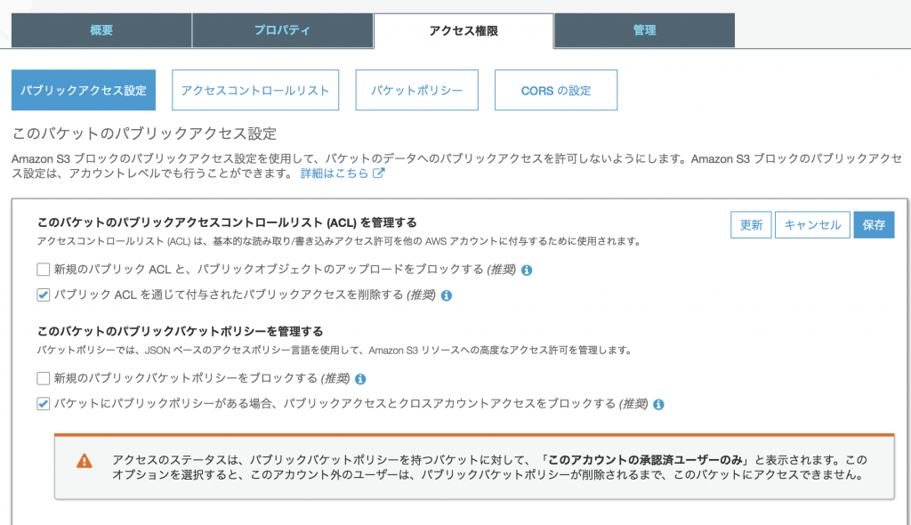

どうも greendiver234 です。
オープンソースやると色々なサービスがフリーで使えてめっちゃええなぁ。と思いながらTravisCIを使ったところ盛大にハマったのであらためて学習した内容と合わせてメモしておきます。

## ハマったこと

表題の通りです。
TravisCIのdeploy lifecycleでs3を指定し、 `acl: public_read` を追加したところ
「Oops, It looks like you tried to write to a bucket that isn't yours or doesn't exist yet. Please create the bucket before trying to write to it.」
というエラーが出て困ったちゃんになりました。

## 結論

先に対処方法を書くとバケットのパブリックアクセス設定を調整することで解消します。
今回のケース(`acl: public_read`)だと、以下の画面のようにバケットの設定を更新すれば成功するようになりました。
(デフォルトだと全部にチェックが入ってました)

<figcaption>パブリックアクセス設定</figcaption>

</figure>

## そもそもS3の権限について

これは先駆者がたくさんまとめてくれているので勉強になる記事をピックアップして紹介します。

* [S3のアクセスコントロールが多すぎて訳が解らないので整理してみる](https://dev.classmethod.jp/cloud/aws/s3-acl-wakewakame/)
* [S3で誤ったデータの公開を防ぐパブリックアクセス設定機能が追加されました](https://dev.classmethod.jp/cloud/aws/s3-block-public-access/)

2018年11月にS3のパブリックアクセス設定に関する機能が追加され、以降デフォルトのパブリックアクセス設定が厳しくなったために今回の現象が発生したのだと考えられます。
[https://aws.amazon.com/jp/blogs/aws/amazon-s3-block-public-access-another-layer-of-protection-for-your-accounts-and-buckets/](https://aws.amazon.com/jp/blogs/aws/amazon-s3-block-public-access-another-layer-of-protection-for-your-accounts-and-buckets/)

## TravisCIのドキュメントは、、

TravisCIの[公式ドキュメント](https://docs.travis-ci.com/user/deployment/s3/#s3-acl-via-option)では今のところ(2019年5月13日)バケットポリシーを調整することで対処するようにしか記載されていないので、これについては別途問い合わせしておこうと思います。(多分すぐに更新されるでしょう)